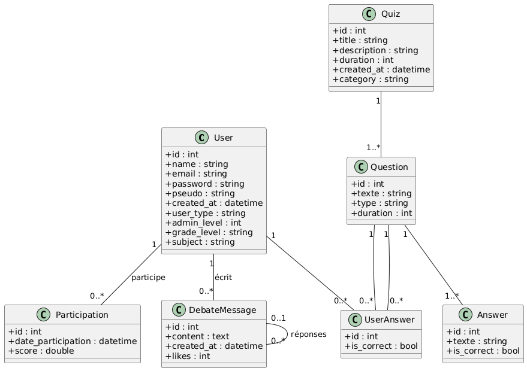

#  EduQuest - Plateforme de quiz éducatifs interactifs



**EduQuest** est une plateforme de quiz pédagogique développée avec **Symfony 7**, permettant aux élèves, enseignants et administrateurs de s’impliquer dans l’apprentissage à travers des quiz variés, des outils de suivi et un espace d’échange en ligne.

---

## Objectifs du projet

- Favoriser l’apprentissage par le jeu
- Permettre aux enseignants de créer et gérer des quiz
- Offrir un suivi de progression personnalisé
- Promouvoir l’échange entre les rôles via un forum intégré

---

##  Rôles utilisateurs

-  **Élève** : réalise les quiz, consulte sa progression, participe au forum
-  **Enseignant** : crée/modifie/supprime des quiz, participe au forum
-  **Administrateur** : gestion avancée, visibilité sur tout le contenu

---

##  Fonctionnalités principales

-  Inscription et connexion sécurisée avec rôle attribué
-  Quiz par thématique (Histoire, Maths, etc.)
-  Question du jour : une nouvelle question chaque jour
-  Forum intégré avec système de réponse & likes
-  Suivi de la progression des utilisateurs
-  Interface admin via **Adminer**

---

##  Stack technique

| Technologie     | Usage                           |
|----------------|----------------------------------|
| PHP Symfony 7   | Backend principal                |
| Twig            | Templating frontend              |
| Doctrine ORM    | Mapping base de données          |
| Adminer         | Interface BDD              |
| JavaScript      | Interactions dynamiques          |
| CSS / Bootstrap | Style et responsive              |
| Docker          | Conteneurisation de l’app        |

---


---

##  Installation & Lancement

###  Prérequis

- Docker & Docker Compose
- Composer (pour gestion des dépendances PHP)

###  Instructions

```bash
# 1. Cloner le projet
git clone  https://github.com/Nazim6702/EduQuest.git


# 2. Lancer les services Docker
docker compose up -d --build

# 3. Installer les dépendances PHP
docker exec -it eduquest_php bash
composer install
php bin/console doctrine:migrations:migrate
exit

# 4. Modifier le fichier host
127.0.0.1 eduquest.local
accès à la plateforme via eduquest.local

